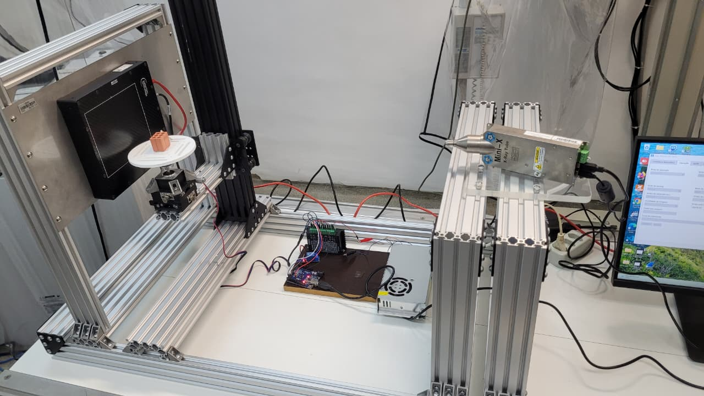

# MicroXplorer

Protótipo de tomografia computadorizada (TC) de raios X desenvolvido no **CPqCTR**, **CCAM** e **UESC**.

---

## Sobre o projeto

O **MicroXplorer** é um sistema experimental de TC de raios X de baixo custo, construído para aquisição e reconstrução de amostras diversas — desde objetos biológicos até materiais de construção civil.

**Portal de download das amostras:** [MicroexplorerPage](https://antonio-hos.github.io/MicroexplorerPage/)

---

## Estrutura experimental (hardware)

O sistema utiliza os seguintes componentes:

| Componente | Equipamento |
|---|---|
| **Detector** | X-PANEL 1412i (1400 × 1200 px, 14 bits) |
| **Fonte de raios X** | Tubo Mini-X2 |
| **Controle de rotação** | Arduino Uno + motor de passo |
| **Estrutura mecânica** | Perfis metálicos (base e suporte do conjunto) |

<p align="center">
  
</p>

### Fluxo de aquisição

1. Posicionar a amostra no eixo de rotação (motor de passo).
2. Acionar a fonte Mini-X2 e capturar projeções com o detector X-PANEL 1412i.
3. Registrar imagens de calibração (**dark** e **flat**).
4. Processar e reconstruir os dados com ferramentas como [TIGRE](https://github.com/CERN/TIGRE).

---

## Mapa do repositório

```
microxplorer/
├── README.md
├── docs/
│   └── images/              # Fotos do equipamento e amostras
├── ProcessSapinhosVitor/    # Notebooks de pós-processamento (Sapinho)
├── TC01_Caracol_202509/
├── TC02_Cachimbo_Arquiometria_20251013/
├── TC03_Sapinho_20251028/
├── TC04_DisciplinaTC_PhoneOuvido_20251216/
├── TC05_DisciplinaTC_Abobora_20251216/
├── TC06_Concreto_Isopor/
├── TC07_Concreto_Isopor_2/
├── TC08_FlatMassivo/
├── TC09_Concreto_Isopor_3/
├── TC10_Concreto_Argila_Expandida_1/
├── TC11_Concreto_Argila_Expandida_2/
├── TC12_Concreto_Ref_1/
└── TC13_Concreto_Ref_2/
```

---

## Pastas e experimentos

Cada pasta `TCxx_*` contém dados brutos de aquisição. A estrutura interna típica inclui:

- `*prjs/` — projeções (`.txt` com metadados + `.dat` com dados brutos)
- `dark/` ou `dark*.txt` — calibração dark
- `flat/` ou `flat*.txt` — calibração flat
- `data.txt` — parâmetros geométricos (SDD, SOD, ODD)
- `python/` — notebooks de visualização (quando disponível)

**Visão rápida dos grupos:**

| Grupo | TCs | Tema |
|---|---|---|
| A | TC01–TC03 | Experimentos iniciais (amostras diversas) |
| B | TC04–TC05 | Disciplina de TC |
| C | TC06, TC07, TC09 | Concreto com Isopor |
| D | TC10–TC11 | Concreto com argila expandida |
| E | TC12–TC13 | Concreto de referência |
| — | TC08 | Calibração flat |
| — | `ProcessSapinhosVitor/` | Pós-processamento (TC03) |
Experimentos agrupados por finalidade e características similares. Pastas do mesmo grupo podem ser comparadas ou reutilizadas com a mesma pipeline de processamento.

---

### Grupo A — Experimentos iniciais (amostras diversas)

> **Características em comum:** primeiros testes do sistema (set–out/2025); múltiplos conjuntos de projeções (5 a 400); notebooks `python/createVideo.ipynb` nos TC01–TC03; calibração em subpastas `dark/` e `flat/`.

| TC | Pasta | Amostra | Projeções | Destaques |
|---|---|---|---|---|
| **TC01** | `TC01_Caracol_202509` | Caracol | 5, 100 e 200 | ODD 10 cm; SDD 52–54,6 cm |
| **TC02** | `TC02_Cachimbo_Arquiometria_20251013` | Cachimbo (arqueometria) | 10 e 400 | SDD 58,5–59 cm; SOD 49,0–49,5 cm; `distancias.txt` |
| **TC03** | `TC03_Sapinho_20251028` | Sapinho | 10 e 400 | Filtros de flat em `flat__Filtering/`; ver também `ProcessSapinhosVitor/` |

---

### Grupo B — Disciplina de TC (dez/2025)

> **Características em comum:** experimentos da disciplina; aquisição padronizada com **400 projeções**; calibração centralizada em `darkflat/`; nomenclatura de pastas por amostra (`*400Prjs/`).

| TC | Pasta | Amostra | Projeções | Destaques |
|---|---|---|---|---|
| **TC04** | `TC04_DisciplinaTC_PhoneOuvido_20251216` | Celular / ouvido | 400 (`PhoneOuvido400Prjs/`) | — |
| **TC05** | `TC05_DisciplinaTC_Abobora_20251216` | Abóbora | 12 e 400 (`abobora12Prjs/`, `abobora400Prjs/`) | — |

---

### Grupo C — Concreto com Isopor

> **Características em comum:** amostras de concreto leve com agregado de Isopor; estudo de materiais de construção civil; geometria SDD ~57,3 cm (TC07 e TC09); **TC09 replica condições do TC07** (`readme.txt`).

| TC | Pasta | Amostra | Geometria / observação |
|---|---|---|---|
| **TC06** | `TC06_Concreto_Isopor` | Concreto + Isopor | SDD 57,3 cm; SOD 37,0 cm |
| **TC07** | `TC07_Concreto_Isopor_2` | CP — Ø 21 mm, 49 mm altura | ODD 6,8 cm; SDD 57,3 cm; SOD 50,5 cm |
| **TC09** | `TC09_Concreto_Isopor_3` | Concreto + Isopor (amostra 2) | Condições similares ao **TC07** |

---

### Grupo D — Concreto com Argila Expandida

> **Características em comum:** par de amostras (**TC10** e **TC11**) da mesma composição (concreto com argila expandida); estrutura com subpasta `prjs/`; indicadas para comparação entre réplicas.

| TC | Pasta | Amostra |
|---|---|---|
| **TC10** | `TC10_Concreto_Argila_Expandida_1` | Concreto com argila expandida |
| **TC11** | `TC11_Concreto_Argila_Expandida_2` | Concreto com argila expandida (réplica) |

---

### Grupo E — Concreto de referência

> **Características em comum:** par de amostras (**TC12** e **TC13**) de concreto de referência; úteis como baseline para comparar com os grupos C (Isopor) e D (argila expandida).

| TC | Pasta | Amostra |
|---|---|---|
| **TC12** | `TC12_Concreto_Ref_1` | Concreto de referência |
| **TC13** | `TC13_Concreto_Ref_2` | Concreto de referência (réplica) |

---

### Calibração

| TC | Pasta | Finalidade |
|---|---|---|
| **TC08** | `TC08_FlatMassivo` | Calibração flat em campo amplo (~200 projeções); dark e flat de referência |

---

### Pós-processamento

| Pasta | Relacionado a | Conteúdo |
|---|---|---|
| `ProcessSapinhosVitor/` | **TC03** (Sapinho) | `LoadSaveAs_mhd.ipynb` — exportação para formato MHD |

---

## Formato dos dados

Cada arquivo `.txt` de projeção contém metadados do detector:

```
ImageFileName=img1.dat
SerialNumber=3000030367-23380001
Width=1400
Height=1200
PixelDepth=14
GainRange=LFW
BinningMode=1x1
```

Os dados brutos ficam nos arquivos `.dat` correspondentes.


## Instituições

| Sigla | Nome |
|---|---|
| **CPqCTR** | Centro de Pesquisas em Ciências e Tecnologias das Radiações |
| **CCAM** | Centro de Computação Avançada e Multidisciplinar |
| **UESC** | Universidade Estadual de Santa Cruz |

---

## Referências

- **TIGRE** — *Tomographic Iterative GPU-based Reconstruction Toolbox*  
  https://github.com/CERN/TIGRE
